# SINAN -- Sistema de Informação de Agravos de Notificação

## Resumo

-  Ano de criação: 1993
-  Cobertura: Dimensões pública e privada do SUS
-  Unidade: Ficha de notificação
-  Divulgação de dados: mensal, com defasagem variada

## Histórico e organização

O SINAN é um instrumento fundamental para a vigilância epidemiológica nacional, sendo responsável por coletar, transmitir e disseminar dados sobre uma lista de doenças e agravos de saúde, cuja notificação é compulsória em todo território nacional. A [lista de doenças e agravos](https://www.gov.br/saude/pt-br/composicao/svsa/notificacao-compulsoria/lista-nacional-de-notificacao-compulsoria-de-doencas-agravos-e-eventos-de-saude-publica) é atualizada permanentemente, conforme mudanças no cenário epidemiológico nacional, contando atualmente com 57 doenças e agravos [@msPortaria33282022; @msPortaria4202022].

Interessante observar que esta lista inclui, além de doenças infecto-contagiosas, a notificação compulsória de acidentes de trabalho, acidentes por animais peçonhentos, eventos adversos de vacinação, casos de óbito infantil e materno e casos de violência doméstica, sexual e tentativas de suicídio, permitindo ao sistema de saúde monitorar rapidamente diversos tipos de eventos de saúde de interesse.

```{mermaid}
%%| fig-cap: "Fluxo de notificação do SINAN"
%%| label: fig-do

flowchart TD
cs[Caso suspeito] --> us[Unidade de Saúde]
us --> not[Notificação do caso suspeito]
not --> sms[Secretaria Municipal de Saúde]
sms --> ses[Secretaria Estadual de Saúde]
ses --> ms[Ministério da Saúde]
us --> aco[Acompanhamento do caso suspeito]
aco --> exam[Exames clínicos e laboratoriais]
exam --> diag[Diagnóstico do caso]
diag --> conf(Caso confirmado)
diag --> desc(Caso descartado)
diag --> incon(Caso inconclusivo)
conf --> atua[Atualização do caso suspeito]
desc --> atua
incon --> atua
atua --> sms
```

A estrutura do SINAN está sendo revisada com a implantação do projeto "e-SUS SINAN", visando o registro em tempo real das notificações do SINAN, em substituição aos sistemas SINAN NET e SINAN Online atualmente utilizados.

## Estrutura dos dados

O SINAN apresenta dados para *todos os casos suspeitos notificados*, independente do diagnóstico final. Desta forma, para se obter o total de casos *confirmados* para determinada doença ou agravo, deve-se filtrar os dados segundo o diagnóstico final.

Durante epidemias, observa-se no SINAN um aumento de casos notificados, que podem ou não serem confirmados posteriormente com o acompanhamento do caso.

::::: {.callout}
Uma possível utilidade para se manter o registro dos casos descartados é o cálculo do *Indicador de Positividade*, que avalia a proporção de casos confirmados dentre os casos notificados.

$$
pos = \frac{c_c}{c_c + c_d + c_i}
$$

Onde $c_c$ são casos confirmados, $c_d$ são casos descartados e $c_i$ são casos com diagnóstico inconclusivo.
:::

A confirmação de casos, em geral, pode ser feita por exames laboratoriais de sangue e/ou outros amostras, testes rápidos (como Igm e IgC), ou confirmado pelo médico por critérios clínicos e epidemiológicos. Este último critério costuma ser mais adotado em situações de surtos e epidemias, onde há uma escassez de exames disponíveis. Em casos suspeitos de dengue, por exemplo, um caso pode ser confirmado à partir dos sintomas relatados na anamnese clínica desde que o paciente relate também um vínculo epidemiológico com um caso confirmado laboratorialmente.

> Na impossibilidade de realização de confirmação laboratorial específica ou em casos com resultados laboratoriais inconclusivos, deve-se considerar a confirmação por vínculo epidemiológico com um caso confirmado laboratorialmente, após avaliação da distribuição espacial e espaço-temporal dos casos confirmados.[@ministeriodasaudeGuiaVigilanciaEm2024]

:::::: {.callout-note}
Dados de casos suspeitos reportados no SINAN podem apresentar diversas variáveis de datas e locais relativas a diferentes momentos do acompanhamento do caso. As datas mais comuns são: data de provavel infecção, data de notificação, data de digitação, data do(s) exames laboratoriai(s), data do diagnóstico final. Já as variáveis de localização mais comuns são: município/UF de provavel infecção, município/UF de residência e município/UF de notificação.

Para o acompanhamento epidemiológico, é mais usual a adoção da data de provavel infecção e município/UF de provavel infecção.

Casos onde o município/UF de provavel infeção é o mesmo que o de residência podem ser classificados como "autoctones", ou seja, a doença foi contraída no mesmo município/UF de residência do paciente. Já casos onde a município/UF de provavel infeção é diferente do município/UF de residência podem ser classificados como "alotoctones".
:::

Dada a diversidade de doenças e agravos cobertos pelo SINAN, arquivos de diferentes estruturas de dados são disponíveis, apresentados a seguir.


### Acidende de trabalho com material biológico

-  Prefixo dos arquivos: ACBI

### Acidente de trabalho

-  Prefixo dos arquivos: ACGR

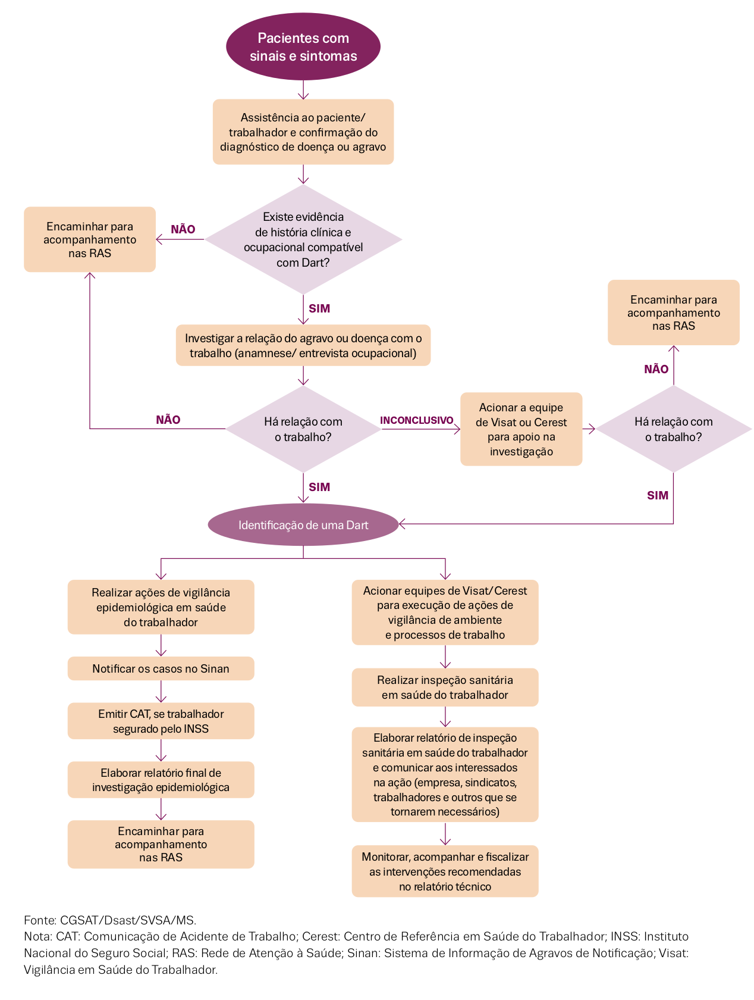{#fluxo_ACGR}

Fonte: @ministeriodasaudeGuiaVigilanciaEm2024a

### AIDS em adultos

-  Prefixo dos arquivos: AIDA
-  Códigos CID-10
  -  Infecção pelo HIV: Z21
  -  Aids: B20-B24
  -  Gestante HIV: Z21
  -  Criança exposta ao HIV: Z20.6

### AIDS em crianças

-  Prefixo dos arquivos: AIDC
-  Código CID-10 (Criança exposta ao HIV): Z20.6

### Acidentes por Animais Peçonhentos

-  Prefixo dos arquivos: ANIM
-  Códigos CID-10
   -  Acidente ofídico: X20 e T63.0
   -  Escorpionismo: X22 e T63.2
   -  Araneísmo: X21 e T63.3
   -  Lonomia e outras lagartas: X25 e T63.4
   -  Himenópteros (abelhas, vespas e formigas): X23 e T63.4
-  [Ficha de notificação](assets/sinan/agravos/ANIMPN_FICHA.pdf)
-  [Instrucional](assets/sinan/agravos/ANIMPN_INSTRUCIONAL.pdf)
-  [Roteiro de uso](assets/sinan/agravos/ANIMPN_CADERNO_ANALISES.pdf)
-  [Dicionário de dados](assets/sinan/agravos/ANIMPN_DIC_DADOS.pdf)

### Atendimento antirrabico

-  Prefixo dos arquivos: ANTR

### Botulismo

-  Prefixo dos arquivos: BOTU
-  CID-10: A05.1
-  [Ficha de notificação](assets/sinan/agravos/BOTUN_FICHA.pdf)
-  [Instrucional](assets/sinan/agravos/BOTUN_INSTRUCIONAL.pdf)
-  [Dicionário de dados](assets/sinan/agravos/BOTUN_DIC_DADOS.pdf)

### Câncer relacionado ao trabalho

-  Prefixo dos arquivos: CANC

### Doença de Chagas

-  Prefixo dos arquivos: CHAG
-  CID-10: B57
-  [Ficha de notificação](assets/sinan/agravos/CHAGAN_FICHA.pdf)
-  [Instrucional](assets/sinan/agravos/CHAGAN_INSTRUCIONAL.pdf)
-  [Dicionário de dados](assets/sinan/agravos/CHAGAN_DIC_DADOS.pdf)

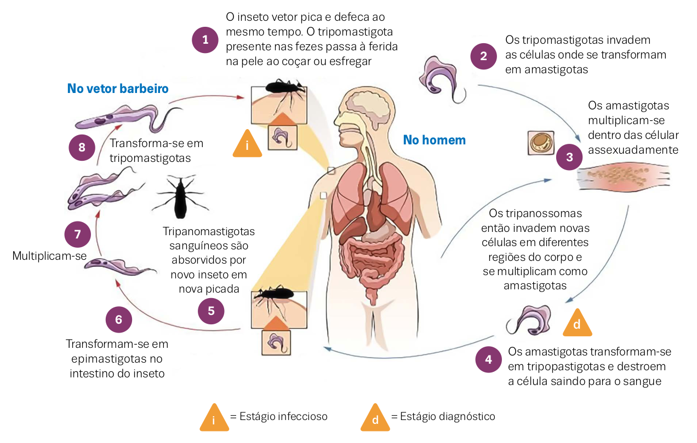{#ciclo_chagas}

Fonte: @ministeriodasaudeGuiaVigilanciaEm2024

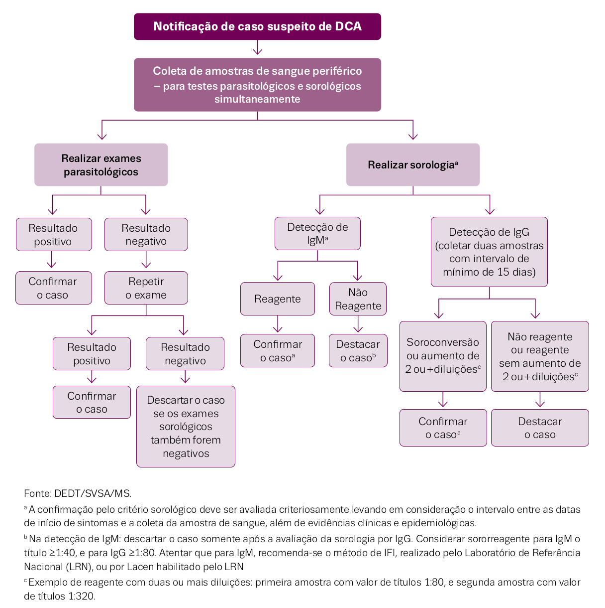{#fluxo_chagas_aguda}

Fonte: @ministeriodasaudeGuiaVigilanciaEm2024


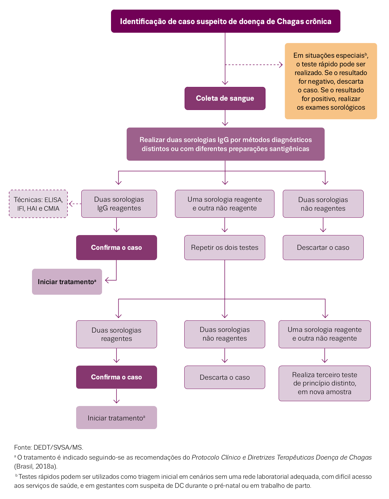{#fluxo_chagas_cronica}

Fonte: @ministeriodasaudeGuiaVigilanciaEm2024


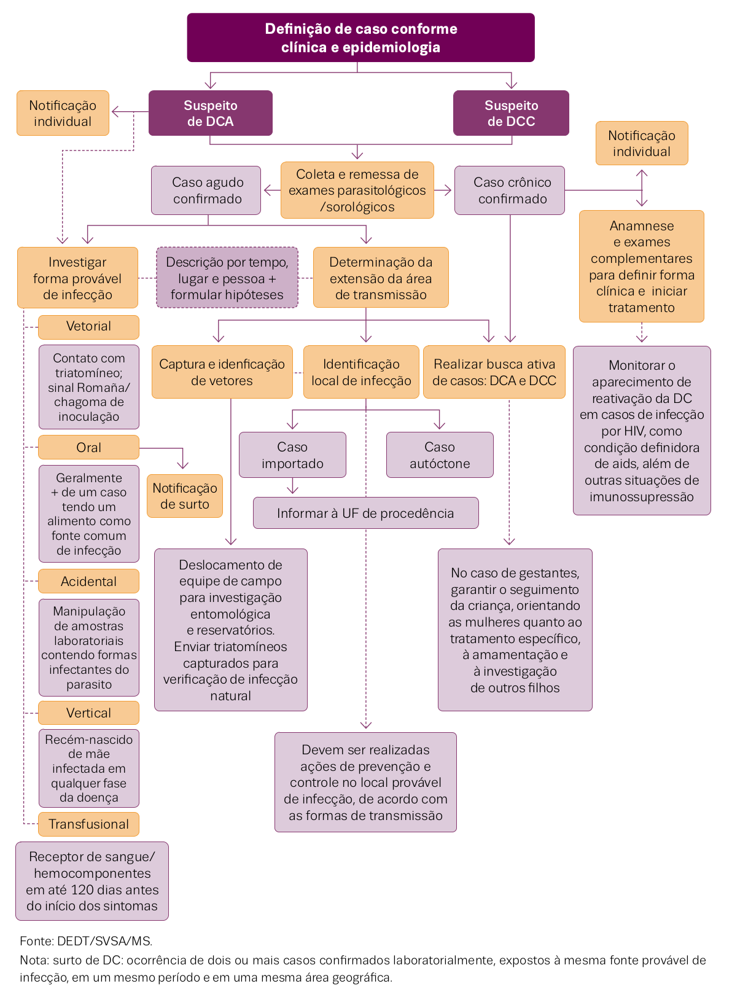{#invest_chagas}

Fonte: @ministeriodasaudeGuiaVigilanciaEm2024

### Chikungunya

-  Prefixo dos arquivos: CHIK
-  [OpenDataSUS](https://opendatasus.saude.gov.br/dataset/arboviroses-febre-de-chikungunya)

### Cólera

-  Prefixo dos arquivos: COLE
-  Código CID-10: A00
-  [Ficha de notificação](assets/sinan/agravos/COLEN_FICHA.pdf)
-  [Instrucional](assets/sinan/agravos/COLEN_INSTRUCIONAL.pdf)
-  [Dicionário de dados](assets/sinan/agravos/COLEN_DIC_DADOS.pdf)

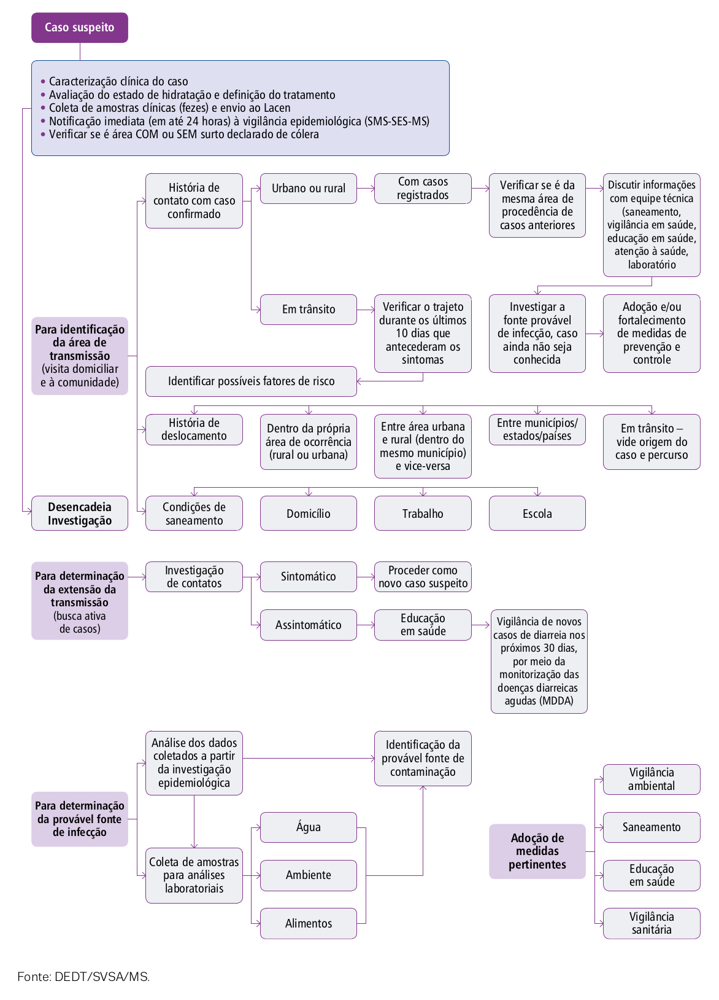{#fluxo_colera}

Fonte: @ministeriodasaudeGuiaVigilanciaEm2024a

### Coqueluche

-  Prefixo dos arquivos: COQU
-  CID-10: A37
-  [Ficha de notificação](assets/sinan/agravos/COQUEN_FICHA.pdf)
-  [Instrucional](assets/sinan/agravos/COQUEN_INSTRUCIONAL.pdf)
-  [Dicionário de dados](assets/sinan/agravos/COQUEN_DIC_DADOS.pdf)

### Dengue

-  Prefixo dos arquivos: DENG
-  [Ficha de notificação](assets/sinan/agravos/DENGON_FICHA.pdf)
-  [Instrucional](assets/sinan/agravos/DENGON_INSTRUCIONAL.pdf)
-  [Dicionário de dados](assets/sinan/agravos/DENGON_DIC_DADOS.pdf)
-  [Nota informativa](assets/sinan/agravos/DENGON_NOTA_INFORMATIVA.pdf)
-  [OpenDataSUS](https://opendatasus.saude.gov.br/dataset/arboviroses-dengue)

### Dermatoses ocupacionais

-  Prefixo dos arquivos: DERM
-  CID-10: L98.9

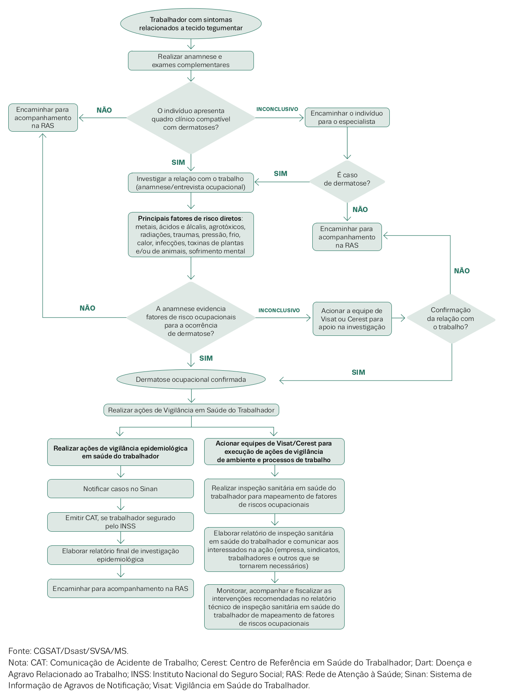{#fluxo_dermatose_ocup}

Fonte: @ministeriodasaudeGuiaVigilanciaEm2024b

### Esporotricose (Epizootia)

-  Prefixo dos arquivos: ESPO
-  CID-10: B42

### HIV em adultos

-  Prefixo dos arquivos: HIVA

### HIV em crianças

-  Prefixo dos arquivos: HIVC

### HIV em crianças expostas

-  Prefixo dos arquivos: HIVE

### HIV em gestante

-  Prefixo dos arquivos: HIVG

### Influenza pandêmica

-  Prefixo dos arquivos: INFL

### Rotavírus

-  Prefixo dos arquivos: ROTA
-  CID-10: A08.0
-  [Dicionário de dados](assets/sinan/agravos/DIC_DADOS_ROTA_NET_v5.1.pdf)

### Surto de doenças transmitidas por alimentos

-  Prefixo dos arquivos: SDTA

### Difteria

-  Prefixo dos arquivos: DIFT
-  CID-10: A36
-  [Ficha de notificação](assets/sinan/agravos/DIFTEN_FICHA.pdf)
-  [Instrucional](assets/sinan/agravos/DIFTEN_INSTRUCIONAL.pdf)
-  [Dicionário de dados](assets/sinan/agravos/DIFTEN_DIC_DADOS.pdf)

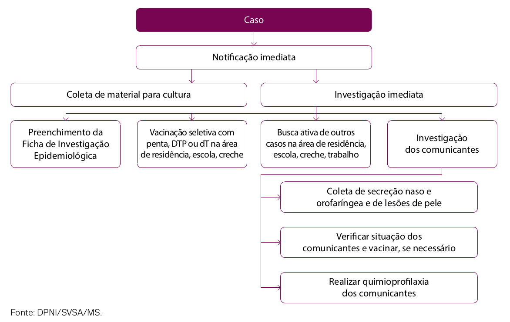{#fluxo_difteria}

Fonte: @ministeriodasaudeGuiaVigilanciaEm2024a

### Esquistossomose mansoni

-  Prefixo dos arquivos: ESQU
-  CID-10: B65.1
-  [Ficha de notificação](assets/sinan/agravos/ESQUIN_FICHA.pdf)
-  [Instrucional](assets/sinan/agravos/ESQUIN_INSTRUCIONAL.pdf)
-  [Dicionário de dados](assets/sinan/agravos/ESQUIN_DIC_DADOS.pdf)

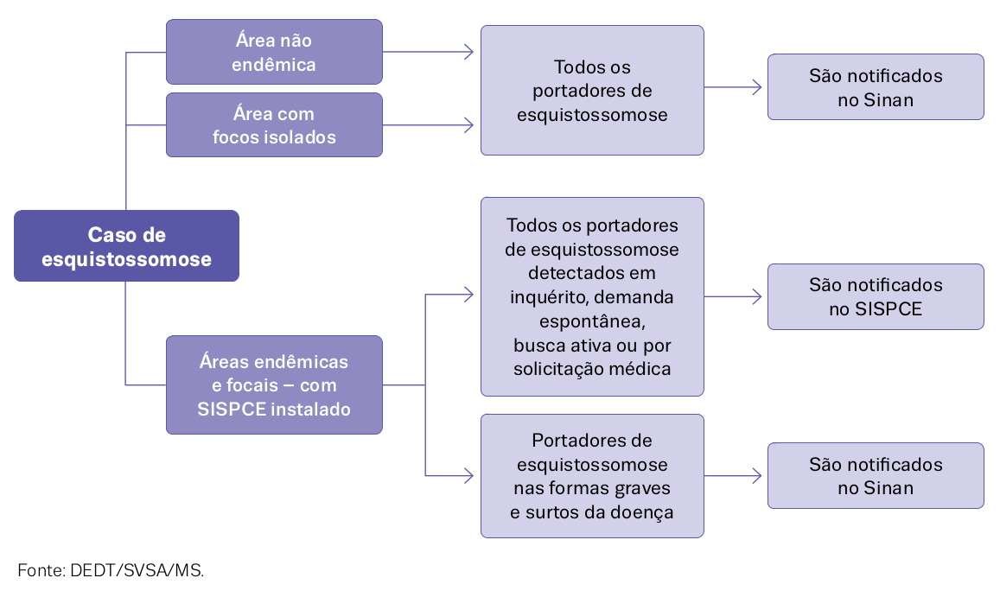{#fluxo_esquistossomose}

Fonte: @ministeriodasaudeGuiaVigilanciaEm2024

### Doenças Exantemáticas

-  Prefixo dos arquivos: EXAN
-  [Ficha de notificação](assets/sinan/agravos/EXANT_FICHA.pdf)
-  [Instrucional](assets/sinan/agravos/EXANT_INSTRUCIONAL.pdf)
-  [Dicionário de dados](assets/sinan/agravos/EXANT_DIC_DADOS.pdf)

### Febre Amarela

-  CID-10: A95
-  [Ficha de notificação](assets/sinan/agravos/FAMARN_FICHA.pdf)
-  [Instrucional](assets/sinan/agravos/FAMARN_INSTRUCIONAL.pdf)
-  [Dicionário de dados](assets/sinan/agravos/FAMARN_DIC_DADOS.pdf)
-  [OpenDataSUS](https://opendatasus.saude.gov.br/dataset/febre-amarela-em-humanos-e-primatas-nao-humanos)

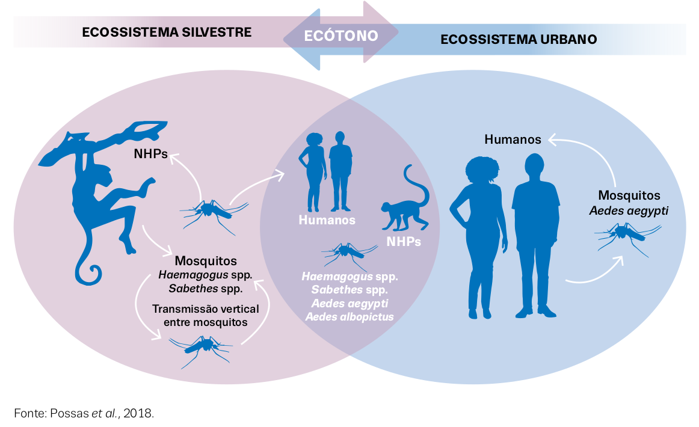{#fluxo_febre_amarela}

Fonte: @ministeriodasaudeGuiaVigilanciaEm2024

### Febre Maculosa

-  Prefixo dos arquivos: FMAC
-  CID-10
   -  Rickettsioses transmitidas por carrapatos: A77
   -  Febre maculosa brasileira: A77.0
   -  Febre maculosa não especificada: A77.9
-  [Ficha de notificação](assets/sinan/agravos/FMACUN_FICHA.pdf)
-  [Instrucional](assets/sinan/agravos/FMACUN_INSTRUCIONAL.pdf)
-  [Dicionário de dados](assets/sinan/agravos/FMACUN_DIC_DADOS.pdf)

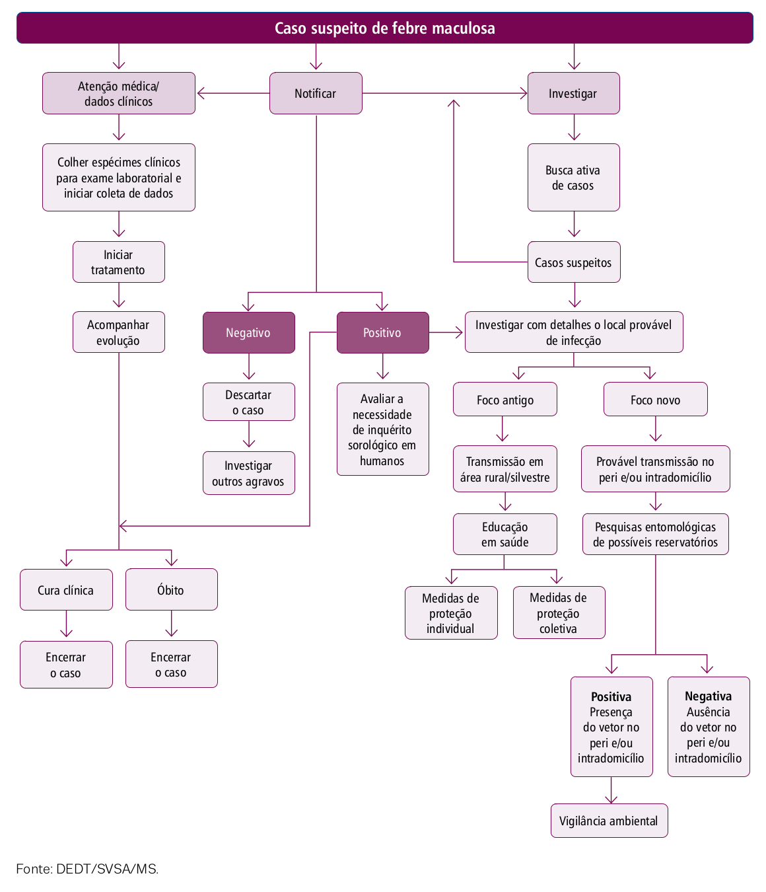{#fluxo_febre_maculosa}

Fonte: @ministeriodasaudeGuiaVigilanciaEm2024b

### Febre Oropouche

-  [POP de manuseio do e-SUS Sinan para a notificação de Febre Oropouche ](assets/sinan/esus/POP-manuseio-e-SUS-Sinan-notificacao-Febre-Oropouche.pdf)

### Febre Tifóide

-  Prefixo dos arquivos: FTIF
-  CID-10: A01.0
-  [Ficha de notificação](assets/sinan/agravos/FTIFON_FICHA.pdf)
-  [Instrucional](assets/sinan/agravos/FTIFON_INSTRUCIONAL.pdf)
-  [Dicionário de dados](assets/sinan/agravos/FTIFON_DIC_DADOS.pdf)

### Hanseníase

-  Prefixo dos arquivos: HANS
-  CID-10: A30
-  [Ficha de notificação](assets/sinan/agravos/HANSN_FICHA.pdf)
-  [Instrucional](assets/sinan/agravos/HANSN_INSTRUCIONAL.pdf)
-  [Caderno de análise](assets/sinan/agravos/HANSN_CADERNO_ANALISES.pdf)
-  [Dicionário de dados](assets/sinan/agravos/HANSN_DIC_DADOS.pdf)

### Hantavirose

-  Prefixo dos arquivos: HANT
-  CID-10: B33.4
-  [Ficha de notificação](assets/sinan/agravos/HANTAN_FICHA.pdf)
-  [Instrucional](assets/sinan/agravos/HANTAN_INSTRUCIONAL.pdf)
-  [Dicionário de dados](assets/sinan/agravos/HANTAN_DIC_DADOS.pdf)

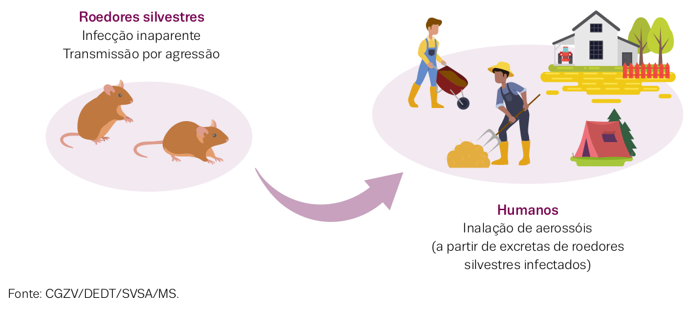{#fluxo_hantavirose}

Fonte: @ministeriodasaudeGuiaVigilanciaEm2024b

### Hepatites Virais

-  Prefixo dos arquivos: HEPA
-  CID-10: B15 – B19.9
-  [Ficha de notificação](assets/sinan/agravos/HEPANET_FICHA.pdf)
-  [Instrucional](assets/sinan/agravos/HEPANET_INSTRUCIONAL.pdf)
-  [Dicionário de dados](assets/sinan/agravos/HEPANET_DIC_DADOS.pdf)

### Intoxicação Hexógena

-  Prefixo dos arquivos: IEXO
-  [Ficha de notificação](assets/sinan/agravos/IEXOGN_FICHA.pdf)
-  [Instrucional](assets/sinan/agravos/IEXOGN_INSTRUCIONAL.pdf)
-  [Dicionário de dados](assets/sinan/agravos/IEXOGN_DIC_DADOS.pdf)

### Leishimaniosse Tegumentar Americana

-  Prefixo dos arquivos: LTAN
-  CID-10: B55.1
-  [Ficha de notificação](assets/sinan/agravos/LTAN_FICHA.pdf)
-  [Instrucional](assets/sinan/agravos/LTAN_INSTRUCIONAL.pdf)
-  [Caderno de análises](assets/sinan/agravos/LTAN_CADERNO_ANALISES.pdf)
-  [Dicionário de dados](assets/sinan/agravos/LTAN_DIC_DADOS.pdf)

### Leishmaniose Visceral

-  Prefixo dos arquivos: LEIV
-  CID-10: B55.0
-  [Ficha de notificação](assets/sinan/agravos/LEISHN_FICHA.pdf)
-  [Instrucional](assets/sinan/agravos/LEISHN_INSTRUCIONAL.pdf)
-  [Caderno de análise](assets/sinan/agravos/LEISHN_CADERNO_ANALISES.pdf)
-  [Dicionário de dados](assets/sinan/agravos/LEISHN_DIC_DADOS.pdf)

### Leptospirose

-  Prefixo dos arquivos: LEPT
-  CID-10: A27
-  [Ficha de notificação](assets/sinan/agravos/LEPTON_FICHA.pdf)
-  [Instrucional](assets/sinan/agravos/LEPTON_INSTRUCIONAL.pdf)
-  [Dicionário de dados](assets/sinan/agravos/LEPTON_DIC_DADOS.pdf)

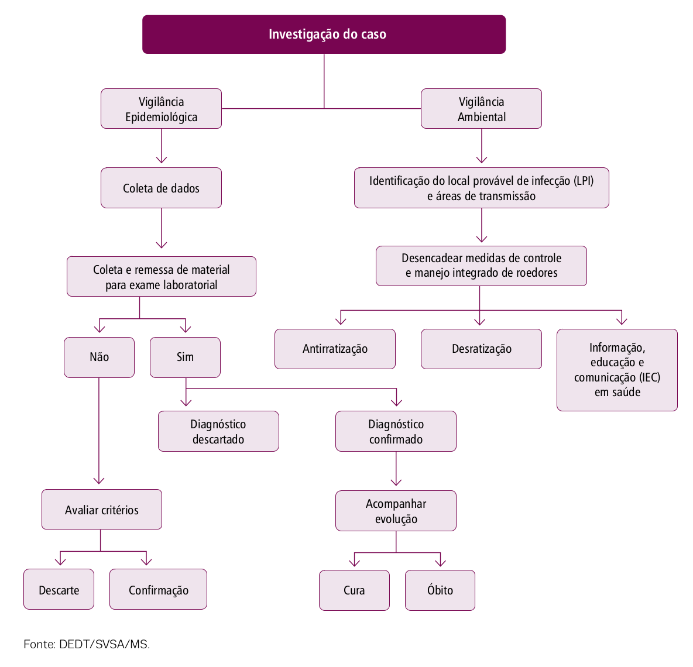{#fluxo_leptospirose}

Fonte: @ministeriodasaudeGuiaVigilanciaEm2024b

### LER/DOT

-  Prefixo dos arquivos: LERD

### Malária

-  Prefixo dos arquivos: MALA
-  CID-10: B50 a B54 / P37.3 e P37.4
-  [Ficha de notificação](assets/sinan/agravos/MALAN_FICHA.pdf)
-  [Instrucional](assets/sinan/agravos/MALAN_INSTRUCIONAL.pdf)
-  [Dicionário de dados](assets/sinan/agravos/MALAN_DIC_DADOS.pdf)

### Meningite

-  Prefixo dos arquivos: MENI
-  CID-10
   - Meningite meningocócica: A39.0
   - Meningococcemia aguda: A39.2
-  [Ficha de notificação](assets/sinan/agravos/MENIN_FICHA.pdf)
-  [Instrucional](assets/sinan/agravos/MENIN_INSTRUCIONAL.pdf)
-  [Caderno de análises](assets/sinan/agravos/MENIN_CADERNO_ANALISES.pdf)
-  [Tutorial de análises epidemiológicas](assets/sinan/agravos/MENIN_TUTORIAL_ANALISES_EPIDEMIO.pdf)
-  [Dicionário de dados](assets/sinan/agravos/MENIN_DIC_DADOS.pdf)

### Transtornos mentais relacionais ao trabalho 

-  Prefixo dos arquivos: MENT

### Notificação de tracoma

-  Prefixo dos arquivos: NTRA
-  CID-10
   -  Tracoma: A71
   -  Sequelas de tracoma: B94.0

### Inquérito de tracoma

-  Prefixo dos arquivos: TRAC

### Perda auditiva por ruído relacionado ao trabalho

-  Prefixo dos arquivos: PAIR

### Monkeypox

A notificação de Monkeypox (Mpox) está sendo realizada com o [e-SUS SINAN](http://plataforma.saude.gov.br/esussinan/), uma nova versão do SINAN.

-  [Ficha de notificação](assets/sinan/esus/ficha-investigacao-monkeypox-e-SUS-Sinan.pdf)
-  [Dicionário de dados](assets/sinan/esus/dicionario-investigacao-monkeypox-esussinan.pdf)
-  [OpenDataSUS](https://opendatasus.saude.gov.br/dataset/mpox)

### Notificação Individual

-  [Ficha de notificação](assets/sinan/agravos/NINDIN_FICHA.pdf)
-  [Dicionário de dados](assets/sinan/agravos/NINDIN_DIC_DADOS.pdf)

### Notificação Individual e-SUS SINAN

-  [Ficha individual de notificação](assets/sinan/esus/ficha-individual-notificacao-conclusao-e-SUS-Sinan.pdf)
-  [Modelo de informação da ficha de notificação](assets/sinan/esus/modelo-informacao-ficha-notificacao-conclusao-e-SUS-Sinan.pdf)

### Peste

-  Prefixo dos arquivos: PEST
-  CID-10: A20
-  [Ficha de notificação](assets/sinan/agravos/PESTEN_FICHA.pdf)
-  [Instrucional](assets/sinan/agravos/PESTEN_INSTRUCIONAL.pdf)
-  [Dicionário de dados](assets/sinan/agravos/PESTEN_DIC_DADOS.pdf)

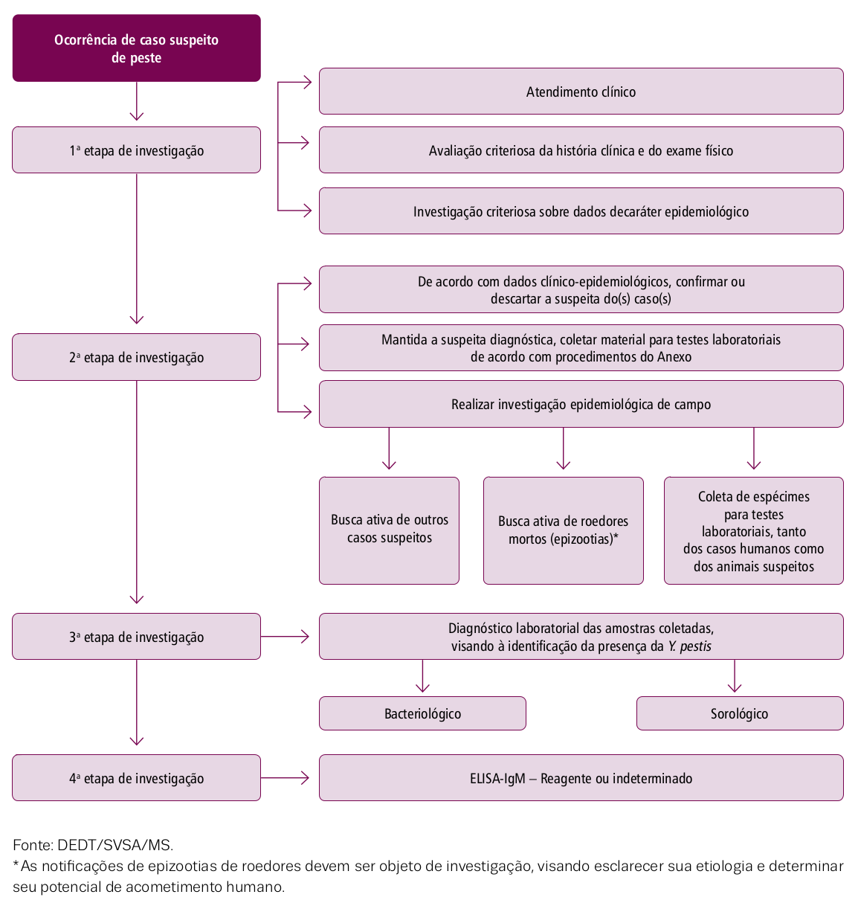{#fluxo_peste}

Fonte: @ministeriodasaudeGuiaVigilanciaEm2024b

### Poliomelite / Paralisia Flácida Aguda

-  Prefixo dos arquivos: PFAN
-  CID-10: A80
-  [Ficha de notificação](assets/sinan/agravos/PFAN_FICHA.pdf)
-  [Instrucional](assets/sinan/agravos/PFAN_INSTRUCIONAL.pdf)
-  [Dicionário de dados](assets/sinan/agravos/PFAN_FICHA.pdf)

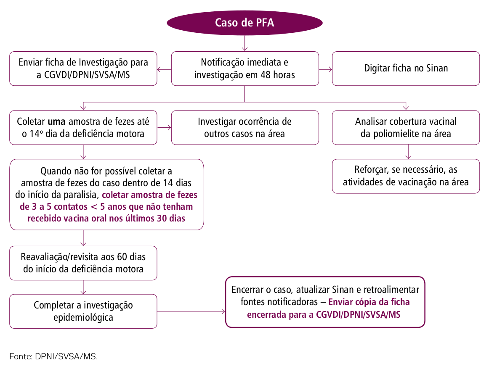{#fluxo_poliomelite}

Fonte: @ministeriodasaudeGuiaVigilanciaEm2024a

### Pneumoconioses relacionadas ao trabalho

-  Prefixo dos arquivos: PNEU
-  CID-10: J64

### Raiva Humana

-  Prefixo dos arquivos: RAIV
-  CID-10: A82
-  [Ficha de notificação](assets/sinan/agravos/RAIVAN_FICHA.pdf)
-  [Instrucional](assets/sinan/agravos/RAIVAN_INSTRUCIONAL.pdf)
-  [Dicionário de dados](assets/sinan/agravos/RAIVAN_DIC_DADOS.pdf)

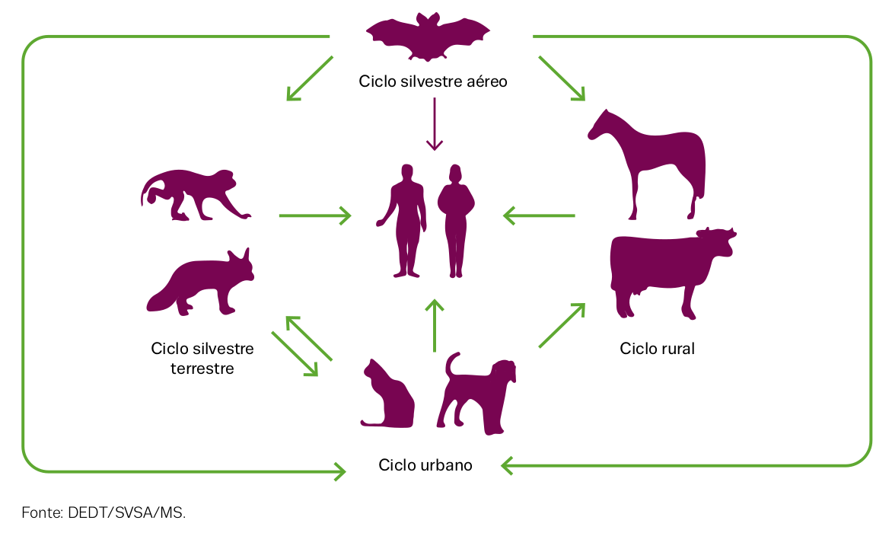{#fluxo_raiva}

Fonte: @ministeriodasaudeGuiaVigilanciaEm2024b

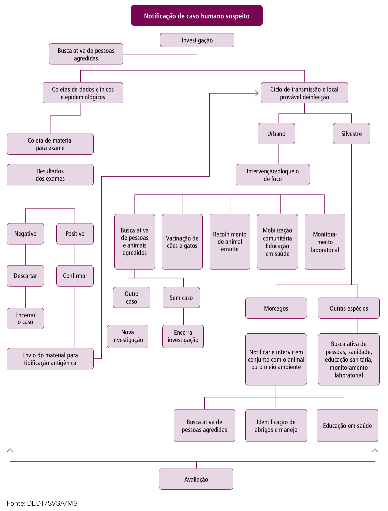{#fluxo_raiva_roteiro}

Fonte: @ministeriodasaudeGuiaVigilanciaEm2024b

### Sífilis adquirida

-  Prefixo dos arquivos: SIFA
-  CID-10: A53.9

### Sífilis Congênita

-  Prefixo dos arquivos: SIFC
-  CID-10: A50
-  [Ficha de notificação](assets/sinan/agravos/SIFICN_FICHA.pdf)
-  [Instrucional](assets/sinan/agravos/SIFICN_INSTRUCIONAL.pdf)
-  [Nota informativa](assets/sinan/agravos/SIFICN_NOTA_INFORMATIVA.pdf)
-  [Dicionário de dados](assets/sinan/agravos/SIFICN_DIC_DADOS.pdf)

### Sífilis em Gestante

-  Prefixo dos arquivos: SIFG
-  CID-10: O98.1
-  [Ficha de notificação](assets/sinan/agravos/SIFIGEN_FICHA.pdf)
-  [Instrucional](assets/sinan/agravos/SIFIGEN_INSTRUCIONAL.pdf)
-  [Nota informativa](assets/sinan/agravos/SIFIGEN_NOTA_INFORMATIVA.pdf
-  [Dicionário de dados](assets/sinan/agravos/SIFIGEN_DIC_DADOS.pdf)

### Síndrome da Rubéola Congênita

-  Prefixo dos arquivos: SRC
-  CID-10: P35.0
-  [Ficha de notificação](assets/sinan/agravos/SRCN_FICHA.pdf)
-  [Instrucional](assets/sinan/agravos/SRCN_INSTRUCIONAL.pdf)
-  [Dicionário de dados](assets/sinan/agravos/SRCN_DIC_DADOS.pdf)

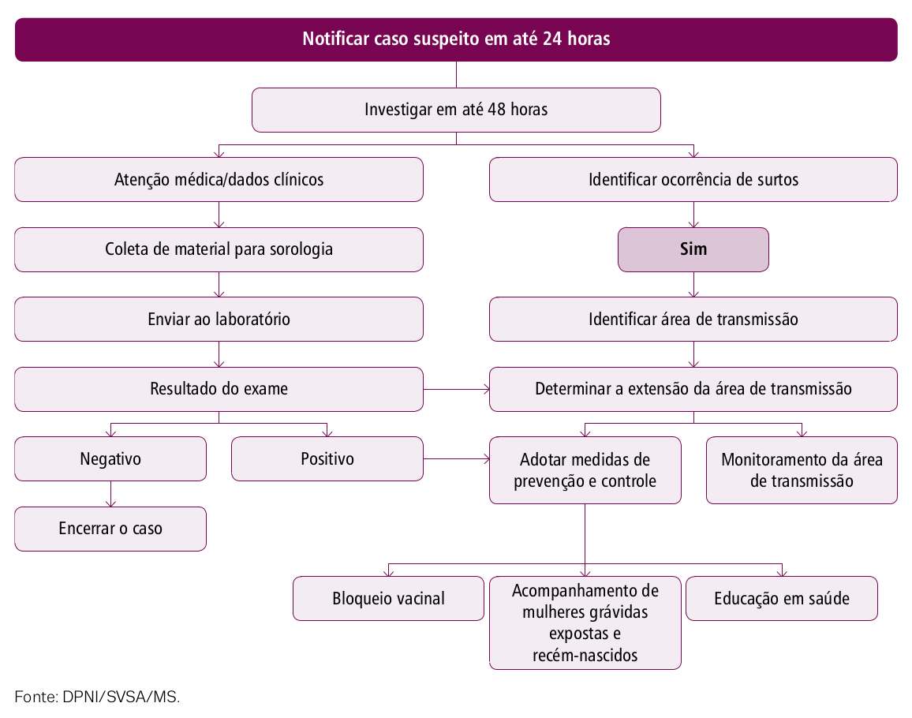{#fluxo_rubeola}

Fonte: @ministeriodasaudeGuiaVigilanciaEm2024a

### Tétano Acidental

-  Prefixo dos arquivos: TETA
-  CID-10: A35
-  [Ficha de notificação](assets/sinan/agravos/TETACN_FICHA.pdf)
-  [Instrucional](assets/sinan/agravos/TETACN_INSTRUCIONAL.pdf)
-  [Dicionário de dados](assets/sinan/agravos/TETACN_DIC_DADOS.pdf)

### Tétano Neonatal

-  Prefixo dos arquivos: TETN
-  CID-10: A33
-  [Ficha de notificação](assets/sinan/agravos/TETANN_FICHA.pdf)
-  [Instrucional](assets/sinan/agravos/TETANN_INSTRUCIONAL.pdf)
-  [Dicionário de dados](assets/sinan/agravos/TETANN_DIC_DADOS.pdf)

### Toxoplasmose congênita

-  Prefixo dos arquivos: TOXC
-  CID-10: P37.1

### Toxoplasmose gestacional

-  Prefixo dos arquivos: TOXG
-  CID-10: O98.6

### Tuberculose

-  Prefixo dos arquivos: TUBE
-  CID-10: A15 a A19; J65; K93.0; M49.0; M90.0; N74.0; N74.1; O98.0; P37.0
-  [Ficha de notificação](assets/sinan/agravos/TUBEN_FICHA.pdf)
-  [Ficha de acompanhamento](assets/sinan/agravos/TUBEN_FICHA_ACOMP.pdf)
-  [Instrucional](assets/sinan/agravos/TUBEN_INSTRUCIONAL.pdf)
-  [Dicionário de dados](assets/sinan/agravos/TUBEN_DIC_DADOS.pdf)

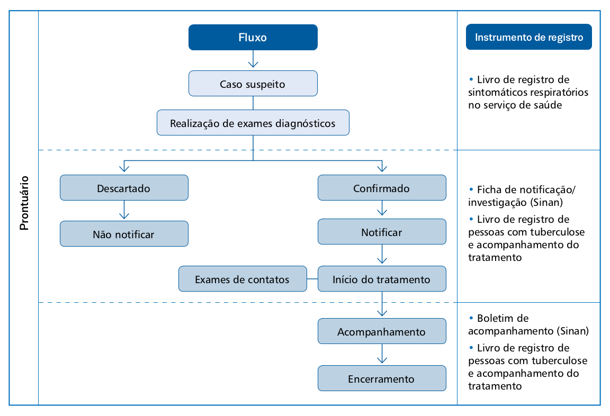{#fluxo_tuberculose}

Fonte: @ministeriodasaudeGuiaVigilanciaEm2024

### Varicela / Herpes-Zóster

-  Prefixo dos arquivos: VARC
-  CID-10: B01/B02

### Violência doméstica, sexual e/ou outras violências

-  Prefixo dos arquivos: VIOL

### Violência Interpessoal/Autoprovocada

-  CID-10: Y09
-  [Ficha de notificação](assets/sinan/agravos/VIOLEN_FICHA.pdf)
-  [Caderno de Análise](assets/sinan/agravos/VIOLEN_CADERNO_ANALISE.pdf)
-  [Dicionário de dados](assets/sinan/agravos/VIOLEN_DIC_DADOS.pdf)

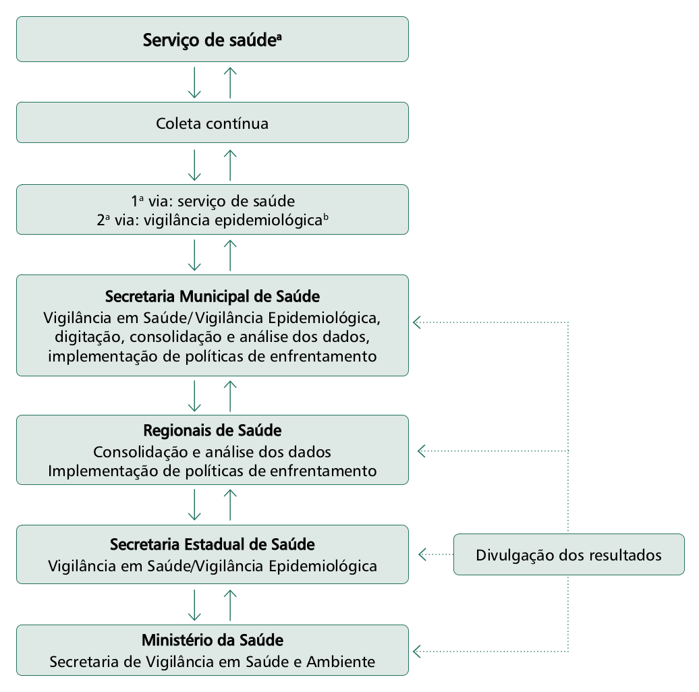{#fluxo_violencia}

Fonte: @ministeriodasaudeGuiaVigilanciaEm2024b

### Zika vírus

-  Prefixo dos arquivos: ZIKA
-  [OpenDataSUS](https://opendatasus.saude.gov.br/dataset/arboviroses-zika-virus)

## Acesso aos dados

### TabNet

Os dados do SINAN podem ser acessados no sistema TabNet do DataSUS, na seção "Epidemiológicas e Morbidade".

-  [TabNet SINAN](https://datasus.saude.gov.br/informacoes-de-saude-tabnet/)

### TabWin

Para uso no TabWin, você irá precisar baixar no servidor de FTP do DataSUS, os arquivos de dados no formato DBC e os arquivos auxiliares para tabulação.

-  [TabWin - Transferência de arquivos](https://datasus.saude.gov.br/transferencia-de-arquivos/)

### R

Você pode usar o pacote [`{microdatasus}`](https://rfsaldanha.github.io/microdatasus/index.html).

```{r}
#| message: false
library(microdatasus)

sinan_raw <- fetch_datasus(
  year_start = 2017,
  year_end = 2017,
  information_system = "SINAN-DENGUE"
)

sinan_p <- process_sinan_dengue(sinan_raw)

sinan_p
```

### Python

Você pode usar a biblioteca PySUS.

-  [PySUS SINAN](https://pysus.readthedocs.io/en/latest/databases/SINAN.html)

### OpenDataSUS

O Ministério da Saúde disponibiliza arquivos atualizados no OpenDataSUS para as seguintes notificações:

-  [Dengue](https://opendatasus.saude.gov.br/dataset/arboviroses-dengue)
-  [Zika](https://opendatasus.saude.gov.br/dataset/arboviroses-zika-virus)
-  [Chikungunya](https://opendatasus.saude.gov.br/dataset/arboviroses-febre-de-chikungunya)
-  [Mpox](https://opendatasus.saude.gov.br/dataset/mpox)
-  [Febre Amarela](https://opendatasus.saude.gov.br/dataset/febre-amarela-em-humanos-e-primatas-nao-humanos)

### InfoDengue

O projeto InfoDengue, mantido pela FGV EMAp e Fiocruz, apresenta estimativas da incidência da Dengue a partir de dados do SINAN, usando técnicas de *nowcasting* para reduzir os efeitos do atraso de notificação. O acesso aos dados é possível por uma API.

-  [InfoDengue](https://info.dengue.mat.br)
-  [InfoDengue API](https://info.dengue.mat.br/services/)

## Bibliografia recomendada

### Documentos auxiliares

-  [Manual do Sistema](assets/sinan/manual_sinan.pdf)
-  [Manual de Normas e Rotinas](assets/sinan/manual_normas_rotinas_2ed.pdf)

### Videos


